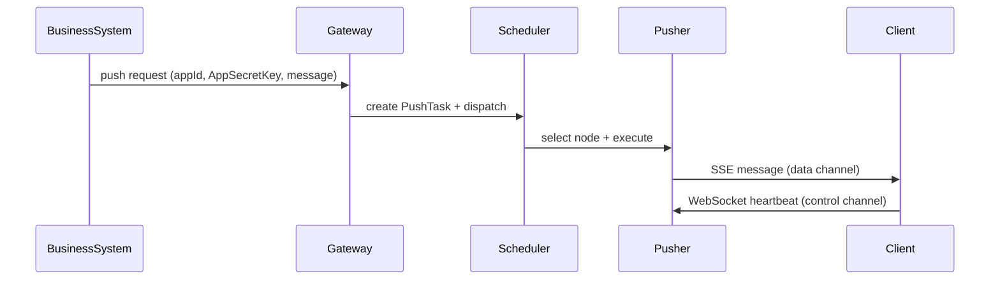

## 《Web消息推送系统详细设计说明书》

**Web Message Push Platform (WMPP) — Detailed Design Document**

- **文档编号**：WMPP-DDD-2026-001  
- **版本**：V1.0  
- **作者**：郑青惟  

---

## 1 系统运行环境设计

### 1.1 软件环境

| 项目 | 说明 |
|---|---|
| 操作系统 | Linux（Ubuntu Server）/ Windows（开发环境可选） |
| 开发语言 | Java 17 |
| 开发框架 | Spring Boot |
| 通信技术 | WebSocket、Server-Sent Events（SSE） |
| 构建工具 | Maven |
| 容器技术 | Docker（规划） |

### 1.2 部署结构

系统采用单机微服务部署模式，各服务运行于独立容器中，通过 HTTP 接口或内部 RPC 通信（当前阶段以 HTTP 为主，预留 RPC）。

---

## 2 模块详细设计

### 2.1 Push Gateway 模块

#### 2.1.1 功能描述

Push Gateway 作为系统统一入口，负责接收业务系统推送请求并进行认证，构造推送任务并提交至 Scheduler。

#### 2.1.2 认证机制（App 级）

- **凭证**：`AppID`、`AppSecretKey`  
- **校验**：  
  - App 是否存在  
  - SecretKey 是否匹配  
  - 是否允许推送（allowPush）  

#### 2.1.3 接口设计

（1）广播推送接口  
`POST /push/broadcast`

| 参数 | 类型 | 说明 |
|---|---|---|
| appId | String | 系统标识 |
| appSecretKey | String | AppSecretKey（Query；与 Header 二选一） |
| X-App-Secret-Key | Header | AppSecretKey（与 Query 二选一） |
| message | String | 推送内容 |

（2）指定用户推送  
`POST /push/user`

| 参数 | 类型 | 说明 |
|---|---|---|
| appId | String | 系统标识 |
| appSecretKey | String | AppSecretKey（Query；与 Header 二选一） |
| X-App-Secret-Key | Header | AppSecretKey（与 Query 二选一） |
| userId | String | 用户标识 |
| message | String | 推送内容 |

（3）Topic/集合推送  
`POST /push/topic`

| 参数 | 类型 | 说明 |
|---|---|---|
| appId | String | 系统标识 |
| appSecretKey | String | AppSecretKey（Query；与 Header 二选一） |
| X-App-Secret-Key | Header | AppSecretKey（与 Query 二选一） |
| topic | String | 订阅主题 |
| message | String | 推送内容 |

> 说明：对外约定固定为 **`message`** 与 **`AppSecretKey`**（Header：`X-App-Secret-Key` 或 Query：`appSecretKey`），避免多套别名导致接入混乱。

---

### 2.2 Scheduler 模块

#### 2.2.1 功能描述

Scheduler 负责推送任务分发与推送节点资源调度，选择合适 Pusher 节点执行推送。

#### 2.2.2 数据结构

```java
class PusherNode {
    String pusherId;
    int connectionCount;
    String ownerSystem; // appId
    boolean active;
}
```

#### 2.2.3 调度算法

- **Round Robin（轮询）**：按 appId 维度进行节点轮询选择  
- **Least Connection（最小连接数）**：预留策略，根据节点连接数选择最空闲节点  

当某业务系统在线连接数量下降时，Scheduler 可将空闲节点重新分配给其他系统使用（预留）。

---

### 2.3 Pusher Worker 模块

#### 2.3.1 功能描述

Pusher Worker 为系统核心模块，负责维护客户端连接并执行消息推送。

#### 2.3.2 WebSocket 连接设计（控制通道）

客户端连接接口（与论文表述一致）：

`ws://host/connect?appId=xxx&userId=xxx`

兼容旧路径：`/ws/push?appId=xxx&userId=xxx`。

**客户端获取端点（HTTP JSON，避免与 WebSocket 握手路径冲突）**：`GET /api/connect?appId=xxx&userId=xxx`，返回 `wsUrl`、`sseUrl`。

连接建立后，系统在 Session Registry 中记录连接信息，用于在线路由与推送定位。

#### 2.3.3 SSE 推送接口（数据通道）

`GET /stream?appId=xxx&userId=xxx`

服务器通过 SSE 流式连接向客户端发送消息（V1.0 可先实现基础推送，后续补齐事件类型、重连与 lastEventId）。

---

### 2.4 Session Registry 模块

#### 2.4.1 数据结构

系统采用如下结构维护在线映射：

`Map<AppId, Map<UserId, Session>>`

示例（伪代码）：

```java
ConcurrentHashMap<String, ConcurrentHashMap<String, WebSocketSession>>
```

#### 2.4.2 连接覆盖机制

当同一用户建立新连接时，旧连接将被关闭并释放资源；注册表更新为新连接。

---

### 2.5 Client SDK 模块

#### 2.5.1 功能

- 建立 WebSocket 控制通道  
- 建立 SSE 数据通道  
- 自动重连  
- 心跳检测  

---

### 2.6 Server SDK 模块

#### 2.6.1 功能

- 提供推送接口封装  
- 自动签名认证（携带 appId + AppSecretKey）  
- 支持广播、单用户、Topic/集合推送  

---

## 3 推送流程时序设计



---

## 4 资源回收机制设计

系统通过心跳检测机制识别失效连接。

- 客户端定期发送心跳（WebSocket）  
- Pusher Worker 记录最后心跳时间  
- 当连接超过设定时间未发送心跳时，Pusher Worker 主动关闭连接并更新 Session Registry  

---

## 5 扩展设计

系统在设计时预留以下扩展能力：

- 多终端连接支持
- 分布式调度支持
- 离线消息模块扩展
- 消息队列接入

