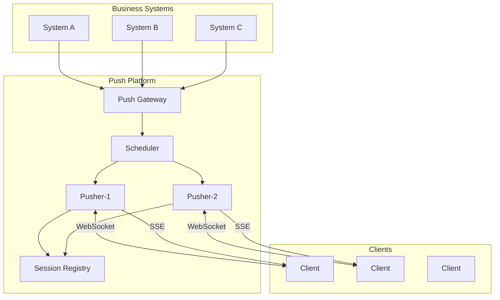
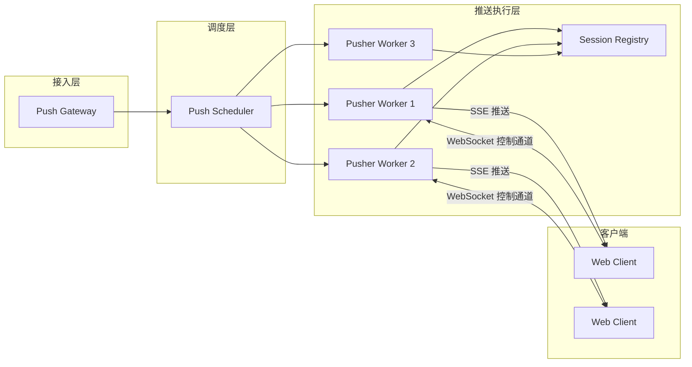

## 《Web消息推送系统需求规格说明书》

**Web Message Push Platform (WMPP) — Software Requirements Specification**

- **文档编号**：WMPP-SRS-2026-001  
- **版本**：V1.0  
- **编写人**：郑青惟  

---

## 1 引言

### 1.1 编写目的

本文档用于描述基于 Web 的消息推送系统的功能需求、性能/质量需求以及系统运行环境，为系统架构设计、编码实现、测试与验收提供依据。

本文档面向系统开发人员、系统测试人员、项目管理人员及毕业论文评审专家。

### 1.2 项目背景

随着移动互联网与 Web 应用的快速发展，各类业务系统对实时消息通知能力的需求不断增强，例如社交平台、新闻平台、电商平台等均需要向用户实时推送通知信息。

传统方式通常由各业务系统自行构建推送服务，带来系统复杂度高、维护成本大及扩展困难等问题。因此，有必要设计统一的消息推送平台，使业务系统通过标准化接口完成消息推送。

本系统通过提供 **Server SDK** 与 **Client SDK**，使业务系统无需自行开发推送基础设施即可完成实时消息通知。

### 1.3 系统组成

| 子系统 | 功能 |
|---|---|
| Push Gateway | 推送接口入口、App 认证、任务创建 |
| Scheduler | 推送任务调度、Pusher 资源选择与分配 |
| Pusher Worker | 长连接维护与消息发送（WebSocket/SSE） |
| Session Registry | 在线连接管理与路由查询 |
| Server SDK | 业务系统调用平台推送接口封装 |
| Client SDK | 客户端建立连接、接收消息、自动重连与心跳 |

---

## 2 系统目标

| 编号 | 目标描述 |
|---|---|
| G-001 | 实现多业务系统统一接入的消息推送平台 |
| G-002 | 支持基于 WebSocket 的长连接维护 |
| G-003 | 支持基于 SSE 的单向实时消息推送 |
| G-004 | 支持广播推送与指定用户推送 |
| G-005 | 具备基础扩展能力，可演进为分布式推送架构 |

---

## 3 系统架构

### 3.1 总体逻辑架构图

### 3.2 分层架构图（论文版）

---

## 4 功能需求

### FR-001 业务系统注册

- **描述**：系统应支持业务系统注册并获得 `AppID` 与 `AppSecret`。  
- **输入**：业务系统名称、联系人/备注等（可扩展）。  
- **输出**：`AppID`、`AppSecret`。  
- **约束**：`AppID` 全局唯一；`AppSecret` 不可逆/不可猜（后续可用更安全的生成与存储）。  

### FR-002 长连接建立

- **描述**：客户端应在连接时携带 `AppID` 与 `userId`。  
- **WebSocket**：`ws://host/ws/push?appId=xxx&userId=xxx`  
- **校验**：  
  - App 合法性校验  
  - 用户是否属于该业务系统（预留扩展）  

### FR-003 消息推送

系统应支持以下推送模式：

- **广播推送**：推送给某业务系统下所有在线用户  
- **指定用户推送**：推送给某业务系统下指定 `userId`  
- **用户集合推送**：推送给某业务系统下指定一组 `userId`（用于 Topic/批量推送等场景）  

### FR-004 连接管理

系统应支持：

- **心跳检测**：客户端定时发送心跳，服务端更新活跃时间  
- **自动断线回收**：超过阈值未心跳则回收连接并更新注册表  
- **动态分配 Pusher**：Scheduler 可根据负载变化调整节点分配（预留）  

---

## 5 非功能需求

- **可扩展性**：系统应支持水平扩展能力，可演进为分布式推送架构（节点池、路由与调度可扩展）。  
- **安全性**：系统应具备基本安全认证能力（App 级认证、接口鉴权、连接握手校验）。  
- **可部署性**：系统应支持容器化部署（Docker），并可在云服务器环境运行。  

---

## 6 约束与范围说明

当前阶段（V1.0）不作为强制实现项，但需保留扩展接口/模块边界：

- 离线消息存储
- 消息队列（Kafka/RabbitMQ 等）
- Redis/分布式路由
- ACK/重试与可靠投递
- 多端同步与消息历史

